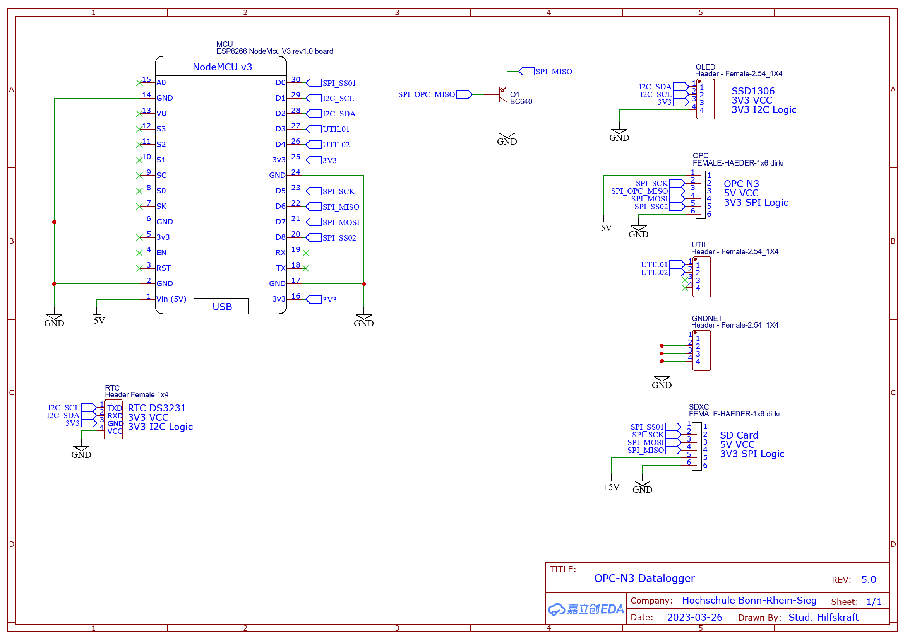
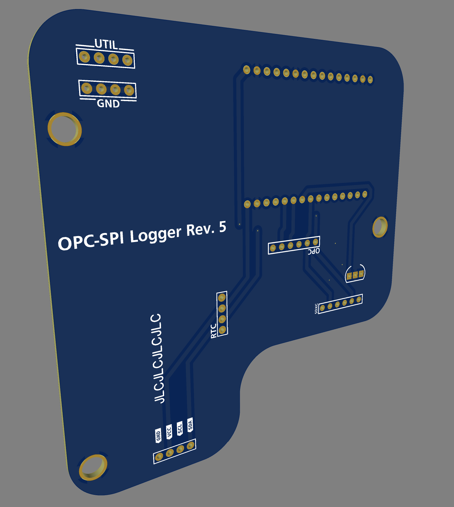

## Part List

### Electrical

- PCB
- Lolin ESP MCU
- SSD1306 OLED Display 0.96"
- MicroSD SPI Board
- DS3231 I²C Board
- Micro USB 30cm Panel Mount Extension with 2x M3 Screws ~29mm hole distance
- 2.54mm THT Screwterminals
- Molex PicoClasp 6pin Cable for the OPC

### Hardware

- 3x M4 Ruthex Threaded Inserts
- 3x Short M4 Screws
- 2x Short M3 Screws (USB Panelmount)
- Hotglue as Strain relief for the OPC Cable

## Additional info

The assembly helpers aid you in soldering the Terminals required to connect the OLED Display and the 6pin OPC Cable to the Mainboard.
You will also need 2 Smaller screws for the Micro USB.
For the Micro SD Card Reader, mount everyting in place without soldering it on.
Solder the Connection to the Mainboard, when the Reader is inserted into the Case, same with the OLED display.

You will have to cut the pico clasp cable, strip the thin cable carefully (I used a Knipex 12 40 200 wire Stripper), and connect it to the terminals.
Use solder on the wire to make it mechanically stronger.
You will need a multimeter to figue out what connection belongs to the cable strand.
I also found it helpful to use braid sleeving to protect the thin cable.

## Schematics

Electrical Schematic  

Printed Circuit Board screenshot  
