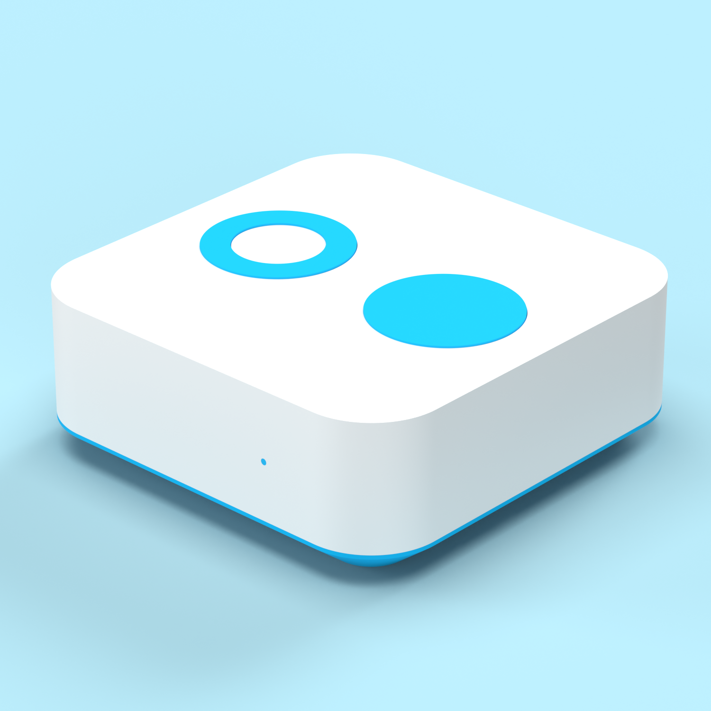
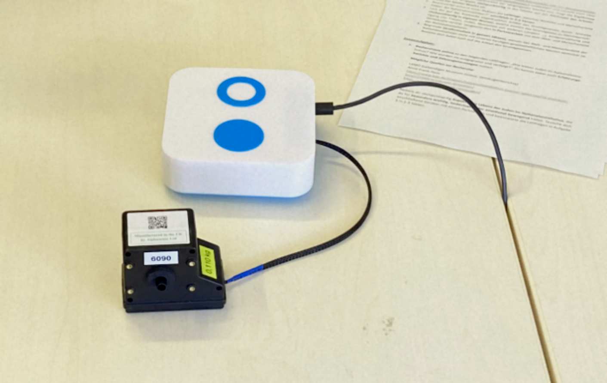

# OPC-N3 Aerosol Sensor LogBox

This Logger records the measured data of an OPC-N3 Aerosol sensor every 5 seconds. The measured interval is 2.5sec long.  
It works fully automatic and begins recording when connected with power and needs no further oversight.

## Images

Render of the Logger  

Logger in the field  
### Size:
  LogBox M (120x120x45mm)  
  5V/300mA  
  
### Specs:
  - NodeMCU V3 LoLin MCU  
  - Real Time Clock DS3231  
  - Micro SD Card Reader  
  

  
### IO:
  - Micro USB-B for Power and Serial Data  
  - OPC-N3 Connector Cable  (6pin Molex Pico-Clasp Connector)  
  - OLED Display  

